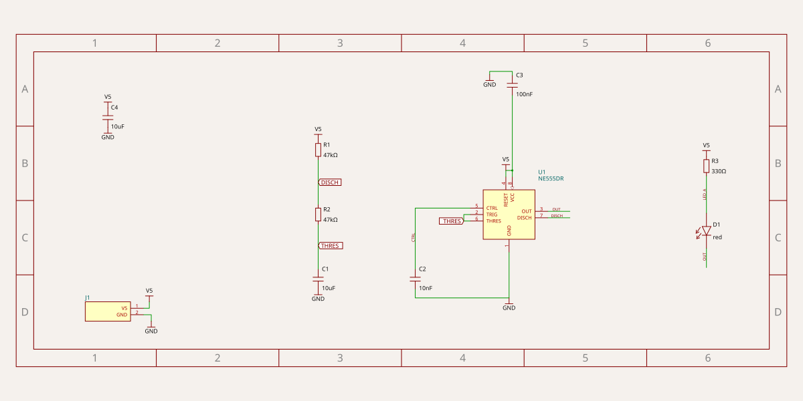
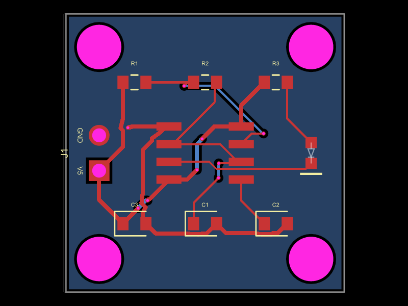
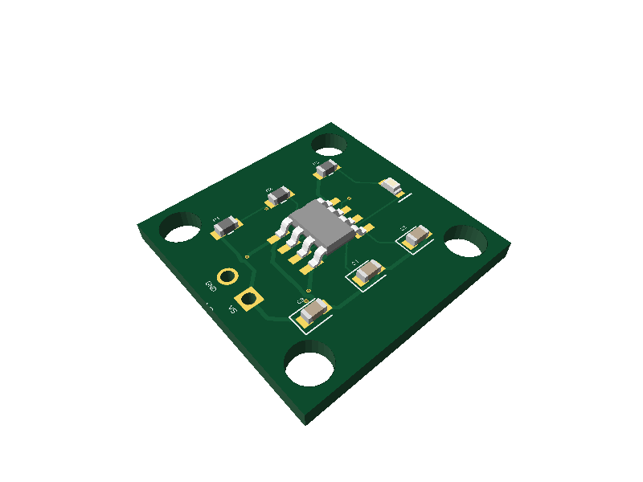

# example-ne555







PCB design written in [tscircuit](https://tscircuit.com) (React/TSX, compiled by the `tsci` CLI). This file is the project doc: requirements, design decisions and status go here and should be kept current as the design evolves.

## Status

First complete draft: 5V NE555 LED flasher, builds cleanly (`tsci build`), `tsci check shorts` and placement DRC are clean. Not yet fabricated or tested on hardware.

## Requirements

- **Purpose:** flash a red SMD LED, 0.3 s ON / 0.6 s OFF, using an NE555.
- **Board size / form factor:** 20 x 20 mm, all parts on the top side (8 x 8 mm was considered but cannot hold the SOIC-8 plus header and passives).
- **Power sources and rails:** single 5 V input on a 2-pin 2.54 mm header (J1: `V5`, `GND`). NE555 minimum supply is 4.5 V, so 5 V is fine.
- **I/O (connectors, headers, mounting holes):** J1 power header, 4x 3.2 mm (M3) mounting holes, one near each corner (7.62 mm from the centre on both axes).
- **Mechanical constraints:** none beyond the above.
- **Manufacturer and constraints:** JLCPCB; all resistors/capacitors 0603; basic parts where one exists; Economic assembly (only parts marked "PCBA Type: Economic and Standard", never "Standard Only").

## Design notes

- **Timing:** a normal 555 astable has HIGH longer than LOW, so the LED is wired from V5 through R3 to the LED and sunk into OUT (pin 3). It is ON while OUT is LOW: ON = 0.693*R2*C1, OFF = 0.693*(R1+R2)*C1. Equal ON/OFF ratio 1:2 means R1 = R2. With R1 = R2 = 43 k and C1 = 10 uF: ON = 0.298 s, OFF = 0.596 s (period ~0.9 s).
- **Capacitor accuracy (decision: keep C1 as is):** C1 is a 10 uF X5R 0603 ceramic (C19702, 10 V, +-10 %). DC bias (5 V on a 10 V part) is the dominant error: it can cut the effective capacitance by a large fraction, so the real period will be longer than the nominal ~0.9 s, by tens of percent. The 1:2 ON/OFF ratio is unaffected, because ON and OFF both scale with C1 and the ratio depends only on R1/R2, and a visual LED flasher needs no accurate period. Alternatives rejected: film/C0G caps do not exist at 10 uF in 0603; tantalum/electrolytic are bigger, polarised and mostly extended or "Standard Only" (breaks Economic assembly); 1 uF 50 V (C15849) would need R1 = R2 = 430 k, where the bipolar NE555's TRIGGER/THRESHOLD bias currents add their own error and 430 k is another extended part. If the period ever matters, measure the assembled board and trim R1/R2 (keep R1 = R2).
- **LED current:** (5 V - ~2.3 V - ~0.2 V OUT low) / 330 ohm ~= 7.6 mA (XL-1608SURC-06, Vf 2.3 V typ).
- **555 housekeeping:** RESET tied to V5, CTRL decoupled by C2 (10 nF), C3 (100 nF) decouples the supply at U1.
- **Footprints:** U1 (SOIC-8) and D1 (0603 LED) use local `<footprint>` definitions with the pad geometry copied from the JLCPCB parts. `footprint="jlcpcb:..."` fetches from the EasyEDA API at build time and fails when it rate-limits (HTTP 403), so avoid it. D1 pin 1 is the cathode (K) on C965799 and is mapped that way. Their 3D bodies are the generic tscircuit models `jscad_models/soic8.glb` and `led0603.glb` from modelcdn.tscircuit.com (via `cadModel`), because custom footprints get no 3D body otherwise.
- **Part numbers:** `supplierPartNumbers={{ jlcpcb: [...] }}` is set on every assembled part with the chosen LCSC numbers (`index.circuit.tsx` is the single source of truth for the BOM). The BOM export only lists parts that carry a supplier part number: without it U1 (custom-footprint chip) and D1 were missing from the fab export, and the parts engine auto-picked other LCSC parts for the passives. The parts engine is disabled (`tscircuit.config.ts` `partsEngineDisabled`, plus `--disable-parts-engine` in the npm scripts): otherwise tscircuit fetches every pinned part from EasyEDA only to cross-check its footprint, which floods the build with warnings when EasyEDA rate-limits (HTTP 403). **Economic assembly:** every part must show "PCBA Type: Economic and Standard" on its jlcpcb.com part page (never "Standard Only"); all current parts do. D1 (C965799, the basic red LED is only 0805; the old C84263 is Standard Only), U1 and R1/R2 (no basic 43 k) are extended parts, the rest are basic.
- **Assembly:** J1 is `doNotPlace` (through-hole header, hand-soldered) so it stays out of the JLCPCB BOM/CPL; everything else is SMD on the top side.
- **Ground pour:** solid copper pour on the bottom layer tied to GND (0.2 mm clearance). The top-layer GND traces are still routed; the pour is tied in through the GND traces' layer-change vias and adds return-path area/shielding. No dedicated stitching vias yet.
- **Trace width:** V5 and GND traces are 0.3 mm (`thickness="0.3mm"` on every trace that touches those nets); signal traces keep the 0.15 mm default.
- **Routing:** autorouted with a few vias; sensible to review in `tsci dev` before fabrication.

Layout rules: see [DESIGN.md](DESIGN.md); its "Project status" lists which rules this board meets and where it deviates. Parts sit on a 1.27 mm grid in two aligned rows (R1-R3 at y = +5.08, C1-C3 at y = -5.08), with J1 and D1 mirrored at x = ±7.62.

## Finding JLCPCB parts

Query the [jlcsearch](https://jlcsearch.tscircuit.com/) JSON API. Prefer basic parts (`is_basic=true`) and pick the highest stock. Example for 22k 0603 resistors:

`https://jlcsearch.tscircuit.com/resistors/list.json?package=0603&is_basic=true&is_preferred=&resistance=22000`

Then open the part page (`https://jlcpcb.com/partdetail/C<number>`) and confirm it says `PCBA Type: Economic and Standard`; jlcsearch does not expose this flag. Record the chosen part as `supplierPartNumbers={{ jlcpcb: ["C..."] }}` in `index.circuit.tsx`. Only fall back to non-basic (extended) parts if no basic one fits.

Also browse [tscircuit datasheets](https://tscircuit.com/datasheets) to discover elements.

## Setup

Requires Node and [Bun](https://bun.sh) (`tsci` runs under Bun; make sure `~/.bun/bin` is on PATH).

```bash
npm install
npm start           # tsci dev: interactive preview
npx tsci build      # compile and validate, output in dist/
npx tsci snapshot -u   # regenerate the schematic SVG snapshot (__snapshots__/index.circuit-schematic.snap.svg, embedded at the top of this README)
npm run export:images    # rebuild and refresh docs/images/{pcb,3d}.png (embedded at the top of this README)
npm run update:skill   # re-install the latest tscircuit AI skill into .claude/skills/tscircuit/ (review with git diff, commit with skills-lock.json)
```

Before sharing or fabricating, work through the checks in order: `tsci check netlist`, `schematic-placement`, `placement`, `routing-difficulty`, then `tsci build`, then `tsci check shorts`. See `.claude/skills/tscircuit/CHECKLIST.md` for the pre-fab checklist.

## References

- [tscircuit docs](https://docs.tscircuit.com/); the full docs are also available as one text file at https://docs.tscircuit.com/llms.txt
- [DESIGN.md](DESIGN.md): PCB alignment and routing rules
- [tscircuit datasheets](https://tscircuit.com/datasheets)
- [jlcsearch](https://jlcsearch.tscircuit.com/)
- AI skill: [tscircuit/skill](https://github.com/tscircuit/skill), installed in `.claude/skills/tscircuit/`

## Open questions / TODO

- **Before ordering:** review routing/silkscreen in `tsci dev` (human check) and confirm the component rotations in JLCPCB's assembly preview. `tsci export` warns "cannot verify jlcpcb pick-and-place rotation" for every SMD part (R1-R3, C1-C3, D1; no supplier pin-1 data is available), so the rotations in `dist/gerbers.zip` (`pick_and_place.csv`) are unverified.
## Decisions

- **Stitching vias:** none. Stitching vias join copper pours on two layers, but there is only one pour (bottom, GND) and the top layer has no pour. The pour is tied to GND through the layer-change vias of the GND traces, which is enough for a 20 x 20 mm, low-speed 5 V board. Revisit only if a top GND pour is added.
- **Fabrication export:** `npm run check:full` is clean (no shorts) and `npm run export:gerbers` produces `dist/gerbers.zip` (Gerbers, drills, `bom.csv`, `pick_and_place.csv`).
